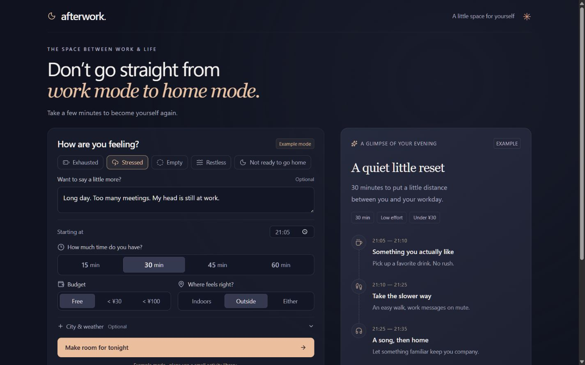
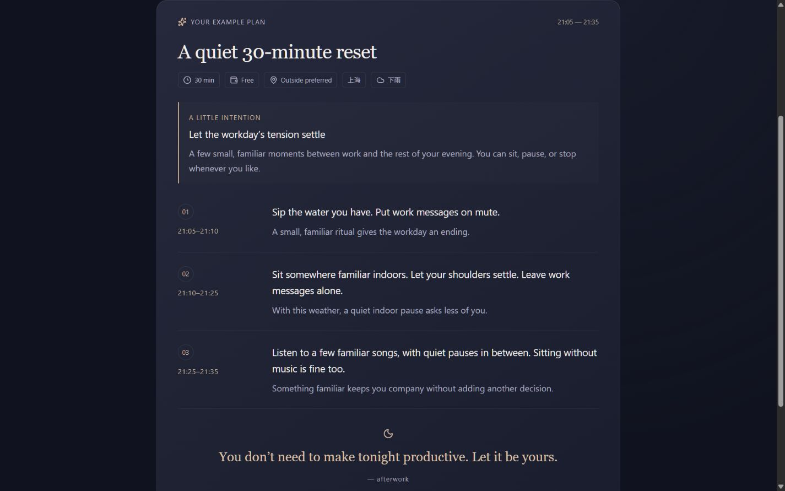
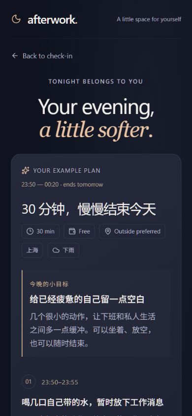

# Afterwork
一个帮助上班族从工作状态过渡到私人生活的轻量级 AI Web 应用。选择当前状态、可支配时间、预算和偏好，得到一份短、低负担、可执行的下班恢复计划。

> Don’t go straight from work mode to home mode.  
> Take a few minutes to become yourself again.

## The Idea
很多人下班后，并不会马上进入私人生活状态。他们可能在地铁站外刷一会儿手机，在车里多坐几分钟，或者漫无目的地走一段路。这些自然存在的过渡时间，说明“离开办公室”和“结束工作状态”之间还有一点距离。

Afterwork 尝试让这段时间更有意识，也更容易安排。它不追求效率、自我提升或复杂的打卡任务，只是给晚上一个柔和的开始。

## Demo
[打开 GitHub Pages 在线体验](https://sunnymoore1314-coder.github.io/afterwork/) · [查看源码仓库](https://github.com/sunnymoore1314-coder/afterwork)

在线体验默认采用个人 AI 手动模式：Afterwork 生成提示词，用户在自己选择的 AI 对话中运行，再将 JSON 结果粘贴回来。也可以在 AI 设置中临时连接 OpenAI、DeepSeek 或兼容 OpenAI 格式的接口。

API Key 只保存在当前浏览器标签页，关闭标签页后清除；请求直接发送到用户选择的服务商。公开或多人使用时，建议继续使用手动模式或改用服务端密钥代理。

界面支持中文和英文切换，语言偏好保存在当前浏览器；AI 提示词和返回语言会跟随界面语言。

城市与天气支持用户主动授权的一次自动定位，也可从内置中国城市列表中搜索选择。天气查询失败时仍可手动填写，不影响生成计划。

浏览器会在本地保存最近 10 份有效计划，支持重新打开、收藏、删除和沿用原条件。历史不会上传或跨设备同步。

计划可以进入执行模式，逐项完成或跳过并显示进度；执行状态在刷新后保留，计划也可复制为纯文本。

### 首页


### 恢复计划


### 移动端中文计划


用户填写状态后，点击 **Prepare my AI prompt**，复制提示词到任意支持 JSON 输出的 AI。将返回内容粘贴到 Afterwork 后，网站会校验字段、活动数量和文字长度，并在浏览器中计算连续时间轴。

## How It Works
```text
User State
    ↓
Context
    ↓
AI Planner
    ↓
Recovery Plan
```

1. 用户选择心情、15／30／45／60 分钟、预算和活动偏好；可以补充一句状态。
2. 开始时间默认采用浏览器本地时间，支持手动编辑。城市和天气是可选的用户输入。
3. 浏览器生成包含约束、上下文和 JSON 格式要求的提示词。
4. 用户在自己的 AI 对话中运行提示词，再复制返回的 JSON。
5. Afterwork 校验响应，确保字段和活动数量匹配，并生成连续时间轴。
6. 结果页展示计划；上下文和计划只保存在当前标签页的 sessionStorage，关闭标签页后清除。

## Tech Stack
- Next.js App Router 风格的页面与 API Route
- TypeScript、React
- Tailwind CSS 4、Radix / Shadcn 表单基础组件
- OpenAI Responses API、Structured Outputs
- Zod 输入与响应校验
- Vinext / Vite 运行与构建，Cloudflare Workers 兼容服务端输出

本项目使用 Vinext 运行 Next.js 风格代码，方便部署服务端生成接口。API 通过 `cloudflare:workers` 的 `env` 读取密钥，不能原样部署到需要 Node.js 环境的 Vercel／普通 Next.js 服务器；迁移时需要更换环境变量适配和构建配置。

## Run Locally
需要 Node.js 22.13 或更高版本和 npm。

```bash
npm ci --include=dev --include=optional
cp .env.example .env
npm run dev
```

Windows PowerShell 中使用：
```powershell
Copy-Item .env.example .env
```

打开 [本地预览](http://localhost:5173)。留空密钥即可体验完整示例流程。

启用真实 AI 时，在本地 `.env` 中配置：
```dotenv
OPENAI_API_KEY=your_server_side_key
OPENAI_MODEL=gpt-4.1-mini
```

然后重启开发服务。密钥仅供服务端使用，不添加 `NEXT_PUBLIC_` 前缀，不写进源代码，不通过用户界面输入。部署环境需单独配置服务端 secret；本地 `.env` 不会发布。

`.env*` 和 `.dev.vars*` 被 Git 忽略，`.env.example` 保留。Cloudflare 本地开发支持 [通过 .env 配置 env 绑定](https://developers.cloudflare.com/workers/local-development/environment-variables/)；不要同时使用 `.dev.vars` 和 `.env`。

## Build
```bash
npx tsc --noEmit
npm run build
npm start
```

构建生成 Cloudflare Workers 兼容的 `dist/server/index.js` 和客户端资源。构建不会调用 OpenAI，也不会消耗模型额度。

## GitHub Pages
GitHub Pages 默认使用个人 AI 手动版：完整支持输入、生成提示词、粘贴 AI 返回结果、校验、时间轴和返回修改。用户也可以自行选择 API 模式，密钥只留在当前标签页。

服务端 AI 版本的代码仍保留在 `app/api/` 和 `lib/ai.ts`，供需要自动调用时使用；GitHub Pages 不运行这些 API。

### 构建静态体验版
```bash
npm ci --include=dev --include=optional
npm run build:pages
```
输出目录为 `pages-dist/`。默认使用相对资源路径，可以部署到仓库子路径。页面使用 `#/result` 路由，刷新结果页不会请求不存在的服务器路径。

### 自动发布
仓库包含 `.github/workflows/pages.yml`：
1. 仓库使用 `main` 分支。
2. 在 **Settings → Pages → Source** 中选择 **GitHub Actions**。
3. 推送 `main` 后，工作流安装依赖、检查 TypeScript、构建静态版并发布。
4. 网站地址以 GitHub Pages 设置页或工作流实际返回的地址为准。

工作流按仓库名称设置 `AFTERWORK_PAGES_BASE`，无需改代码中的链接。Pages 工作流无需配置 OpenAI Secret；手动模式由用户在自己的 AI 对话中完成生成。

参考 [GitHub 官方发布工作流说明](https://docs.github.com/en/pages/getting-started-with-github-pages/using-custom-workflows-with-github-pages)。

## API
`POST /api/generate`

```json
{
  "mood": "exhausted",
  "minutes": 30,
  "budget": 0,
  "preference": "indoors",
  "start_time": "21:05",
  "note": "今天加班到九点，脑子很累。",
  "city": "上海",
  "weather": "下雨"
}
```

- `mood`：`exhausted | stressed | empty | restless | fine`
- `minutes`：`15 | 30 | 45 | 60`
- `budget`：`0 | 30 | 100`（0 元／低于 30 元／低于 100 元）
- `preference`：`indoors | outside | either`
- `start_time`：24 小时制 `HH:mm`
- `note`、`city`、`weather`：可选，最多 600／80／100 个字符

成功响应：
```json
{
  "source": "ai",
  "context": {
    "mood": "exhausted",
    "minutes": 30,
    "budget": 0,
    "preference": "indoors",
    "start_time": "21:05",
    "note": "",
    "city": "",
    "weather": ""
  },
  "plan": {
    "title": "A Quiet 30-Minute Reset",
    "goal": "Slow down before the rest of your evening",
    "summary": "A few small, familiar moments after a long day.",
    "steps": [
      {
        "time": "21:05–21:10",
        "activity": "Sip the water you have",
        "reason": "A small ritual gives work an ending"
      },
      {
        "time": "21:10–21:25",
        "activity": "Sit quietly somewhere familiar indoors",
        "reason": "Give your tired mind some space"
      },
      {
        "time": "21:25–21:35",
        "activity": "Listen to a few familiar songs",
        "reason": "Something familiar keeps you company"
      }
    ],
    "final_message": "You don’t need to make tonight productive."
  }
}
```

`source` 为 `ai` 或 `example`。未配置密钥时只返回 `example`。

`GET /api/status` 返回 `{"mode":"ai"}` 或 `{"mode":"example"}`，不会暴露密钥。

错误返回 `{"error":"…"}`，覆盖无效输入（400）、跨来源请求（403）、过大的请求（413）、错误内容类型（415）、限流（429）、上游失败／拒绝／无效输出（502）和超时（504）。响应设置 `Cache-Control: no-store`。上游最长等待 42 秒，客户端最长等待 50 秒。

## Structured Output
模型只生成内容，不自行计算钟点。活动数固定为：

| 可支配时间 | 活动数量 | 各段时长 |
|---|---:|---|
| 15 分钟 | 2 | 5 + 10 |
| 30 分钟 | 3 | 5 + 15 + 10 |
| 45 分钟 | 3 | 10 + 20 + 15 |
| 60 分钟 | 4 | 10 + 20 + 15 + 15 |

JSON Schema 设置 `strict: true` 和 `additionalProperties: false`，活动数组长度与时间段数量相同。Zod 校验字符串长度、结构和活动数量；时间轴由服务端确定，因此不会出现时间段断开、总时长超出预算或跨午夜计算错误。活动的具体内容、费用和强度通过提示词约束，结构校验不能完全保证语义正确。

AI 提示词限制复杂任务、强度过高的活动、诊断和说教，要求疲惫时优先静坐，免费预算不购物，坏天气优先室内，不编造具体地点和回家通勤时间。中文状态输入会要求模型用简体中文输出。

实现参考 [OpenAI 官方 Structured Outputs 文档](https://developers.openai.com/api/docs/guides/structured-outputs)。请求设置 `store: false`；这并不等同于关闭 OpenAI 的全部服务日志。项目本身没有数据库或用户日志功能。

## Project Structure
```text
app/
  page.tsx
  result/page.tsx
  manual/page.tsx
  history/page.tsx
  focus/page.tsx
  api/generate/route.ts
  api/status/route.ts
components/
  Brand.tsx
  RecoveryForm.tsx
  RecoveryTimeline.tsx
  ui/
lib/
  ai.ts
  planner.ts
  prompts.ts
  types.ts
  recovery-client.ts
  manual.ts
  history.ts
  progress.ts
web/
  main.tsx
  index.html
.github/workflows/pages.yml
scripts/build-pages.mjs
docs/screenshots/
.env.example
README.md
```

## Validation
- TypeScript 检查与生产构建。
- 540 组心情／时长／预算／偏好／开始时间组合。
- 时间连续性、总时长、跨午夜、免费预算、室内偏好和中文雨天示例。
- 模拟 OpenAI 成功响应、拒绝、限流、鉴权错误、超时、非 JSON 和活动数量错误。
- HTTP 接口生成流程、内容类型、请求大小、无效时间与跨来源请求。
- 手动提示词、带或不带 Markdown 代码块的 JSON 导入、错误格式提示和活动数量校验。
- 浏览器中的直接访问空结果页、选择控件、修改开始时间、生成、返回修改，以及桌面和移动端排版。

GitHub Pages 在线版使用个人 AI 手动模式，不保存账号或 API Key。

## Design Decisions
- 把一个生活观察收敛为“输入当前状态 → 得到短计划”的完整产品流程。
- 让 LLM 生成受约束的结构化内容，而不是把产品变成聊天窗口。
- 将时间计算留给确定性的服务端逻辑，减少模型在硬约束上的错误。
- 分清结构校验和语义约束：JSON 合法不等于活动一定合适。
- 保持功能范围清晰，让选择状态、生成计划和返回修改形成完整体验。

## MVP Scope
没有登录、数据库、长期记忆、社交、多 Agent、RAG、地图、Spotify 或日历登录。实时天气、真实附近地点、自动 AI 调用和历史记录不属于 GitHub Pages 手动版本；天气与城市只是可选输入。
